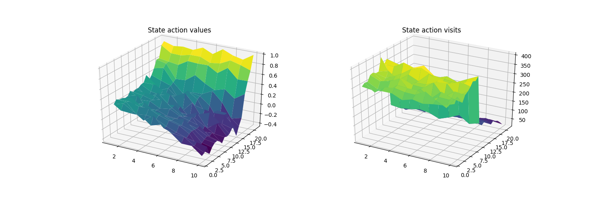
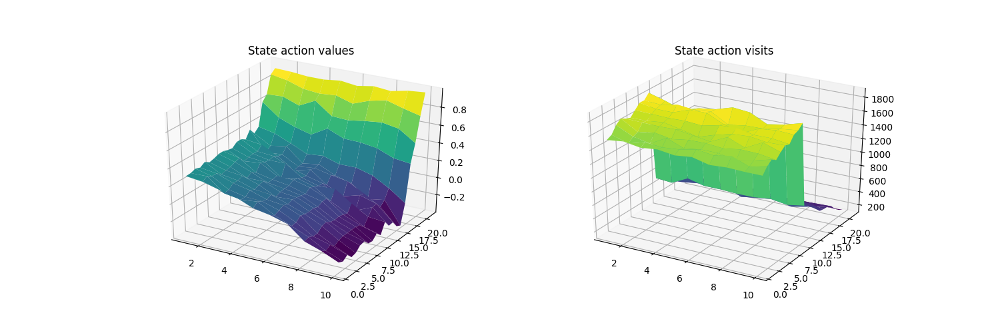
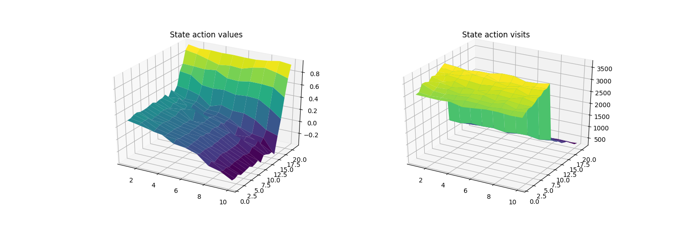
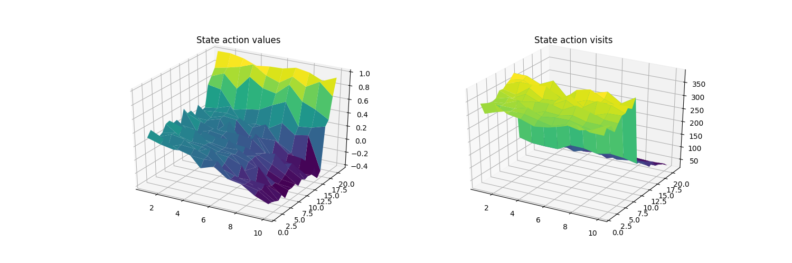
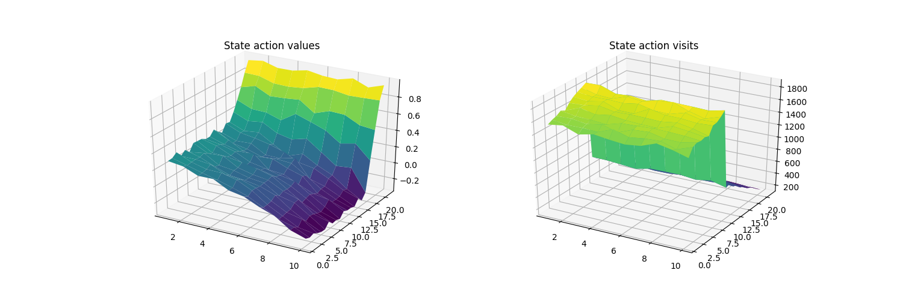
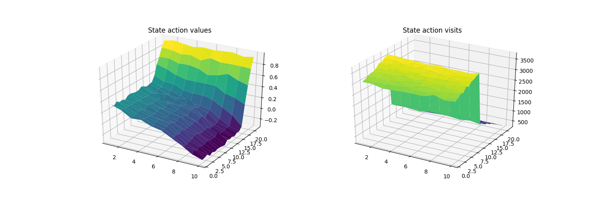

# Easy 21 [WIP]

This repository contains the code for the *Easy 21* assignment of [Reinforcement Learning course](http://www0.cs.ucl.ac.uk/staff/d.silver/web/Teaching.html) by *David Silver*.

## Getting Started

The code has only been tested on *Python 3.5.2*.

### Prerequisites

Here, we will assume that you have already install your *Python*, `pip`, and `virtualenv`. *Python 3.5.2* is recommended because that is the version that was tested, but any *Python 3.x* should work.

### Installing

To get it running on your machine, you have to clone the repository first.

```
git clone git@github.com:hardianlawi/rl-easy-21.git
cd rl-easy-21/
```

After cloning the repository, I would suggest to use `virtualenv` to avoid cluttering your local libraries collection.

```
virtual venv
source venv/bin/active
```

Then install the dependencies from the `requirements.txt`

```
pip install -r requirements.txt
```

## Running the tests

There are Some unit tests though there are many cases that are not covered yet.

To run the unit tests, you have to install [`nosetests`](https://nose.readthedocs.io/en/latest/) (will have been installed if you installed from `requirements.txt`). Then run the code below:

```
bash test/test_runner.sh
```

## Training

Currently, there are two methods implemented, i.e. **Monte Carlo** and **TD Learning**.

To train the agent, simply run:

```
python -m src.main
```

By default, it will train using **Monte Carlo** method, but it can be changed by specifying the argument:

```
python -m src.main --method td_learning
```

### Results

Both methods will ultimately converge to the optimal solution.

Below are the plots for the optimal action value function during the training.

* Monte Carlo

    - After 50000 episodes

        

    - After 250000 episodes

        

    - After 500000 episodes

        

* Temporal Difference Learning

    - After 50000 episodes

        

    - After 250000 episodes

        

    - After 500000 episodes

        

Observe that, though **TD Learning** is much noisier, both methods ultimately converge to close optimal values.

## To-Do

- [ ] Implement a general **TD Learning**, i.e. Sarsa(lambda)
- [ ] Implement **Linear Function Approximation**
- [ ] Plot the winning percentage for every method vs the current heuristics.
- [ ] Create gifs to visualize training.
- [ ] Create error plots with respect to the number of episodes passed for new training using the pre-trained optimal values
- [ ] Visualize the differences in the training progress using different hyperparameters (`gamma` and `n_0`).

## Authors

* **Hardian Lawi**

## Acknowledgments

All the codes here are implemented based on the Author (*Hardian Lawi*) understanding of the Reinforcement Learning course.
